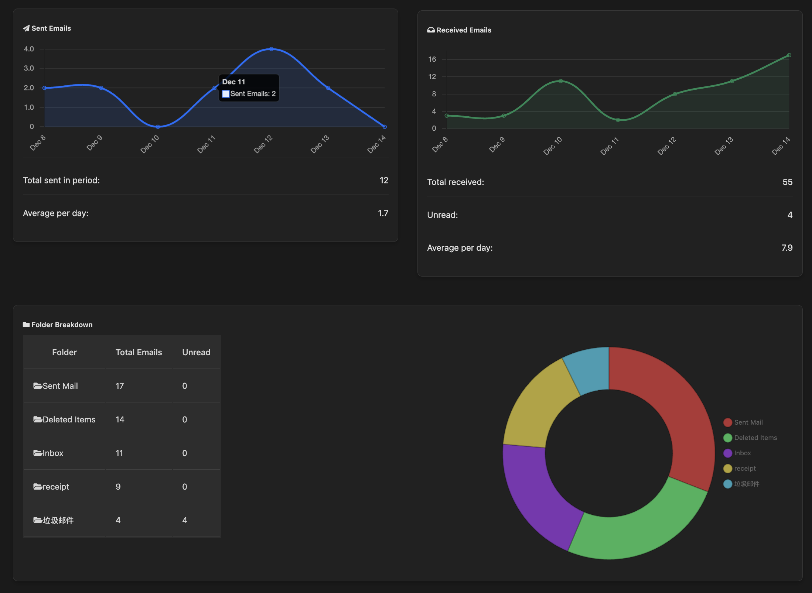

# Mail-Board
[中文版本](README-cn.md)

This is an email stats viewer and content analyser.


## Main Navigation
I here present you a simple navigation page:


## Analysis
clicking on analysis, you will see:
- it shows you the content of your inbox emails
- button to open it up in your running Outlook Client
- calls for antropic api to show:
> how important this email is in relation to your current situation (you need to fill out the configuration.yaml file)
> how much of the consequence you will face if you ignore/delete it
> the recommanded actions to take with regard to the content

| Auto-Reply Analysis                     | Recommended Actions                     |
|-----------------------------------------|-----------------------------------------|
|  |  |

## Stats Dashboard
clicking on stats, you will see:

- sent/received email trends
- daily averages and totals
- folder breakdown visualization
- email category distribution
- unread email tracking

## Requirements
- have a MacOS system
- download a outlook client
- set the outlook version to Legacy

- login to all of your account (it can be any account, e.g., Google). this supports multiple accounts
- set your background in configuration.yaml (remove the .example from its name)

## Setup
1. Clone the repository
2. Copy `configuration.example.yaml` to `configuration.yaml`
3. Configure your Outlook settings
4. run ```python main.py```
5. allow it to access your outlook client in the pop up window

## Future Development
- I will add a requirement.txt shortly

## License
This project is licensed under the included LICENSE file.
No commercial use.

## Why do I make this
- getting emails' stats is really a pain in the ass when mergin multiple services
- my university email doesn't allow openning up a api console
- this is running purely locally, no api is required, it reads email from your system file directly using applescript

---
Note: This interface requires legacy Outlook compatibility for full functionality.